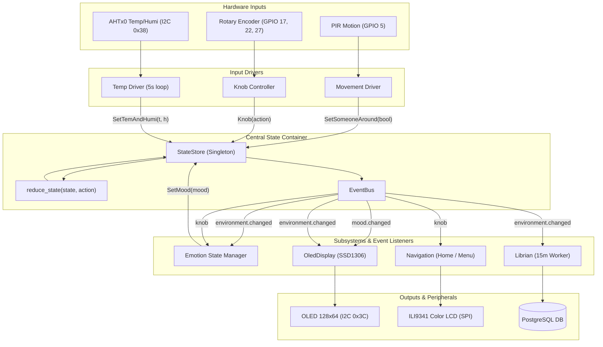

# Remote Monitor — System Architecture & Developer Reference

> **Target Platform:** Raspberry Pi 3 Model B / B+ (Broadcom BCM2837, Quad-Core Cortex-A53, 1GB LPDDR2 RAM, Linux/Raspberry Pi OS)  
> **Primary Runtime:** Python 3.11+ (Asyncio, Threading, CircuitPython/Blinka, Linux GPIO/I2C/SPI)

---

## 1. Project Overview

**Remote Monitor** is an embedded companion and environmental monitoring appliance designed to operate continuously on a Raspberry Pi 3. It combines real-time ambient telemetry, physical presence detection, an autonomous multi-layered "emotional/affective" state machine, multi-screen graphical feedback, and time-series telemetry persistence with a remote web dashboard.

### Core Capabilities
- **Environmental Sensing:** Continuously captures ambient temperature and relative humidity via an AHT10/AHT20 sensor on the primary I2C bus.
- **Presence & Activity Awareness:** Tracks physical presence in the room using a passive infrared (PIR) motion sensor, dynamically transitioning the system between active and energy-saving sleep states.
- **Physical Controls:** Provides user interaction through a rotary encoder with an integrated push button for UI navigation and manual emotional stimulation.
- **Affective Emotion Engine ("Soul"):** Simulates a living personality using a collection of dynamic emotions (Neutral, Happy, Sad, Angry, Curious, Confused, Thinking, Too Cold, Too Hot, Bored, Looking Around). Emotion levels fluctuate based on sensory stimuli, user interactions, decay over time, and automatic cooldown states.
- **Dual Display System:**
  - *OLED Display (SSD1306, 128x64 I2C):* Renders procedural, animated facial expressions reflecting the current mood. Automatically powers down (hides) when no presence is detected.
  - *Secondary / Main LCDs:* Supports both an HD44780 20x4 character LCD (via PCF8574 I2C backpack with character-diff caching) and a 240x320 ILI9341 color TFT display (via high-speed SPI with PIL rendering and power-saving backlight control).
- **Hierarchical UI Navigation:** Stateful screen manager toggling between `Home` and `Menu` locations via rotary encoder input, executing non-blocking animations.
- **Data Persistence:** Automatically logs aggregated environmental readings to a local or network PostgreSQL database at 15-minute intervals.
- **Web Dashboard:** A standalone FastAPI and `asyncpg` web service delivering dark-mode interactive ApexCharts visualisations over configurable timeframes (24 hours, 7 days, 1 month).

---

## 2. Directory Structure & Modules

```
remote-monitor/
├── main.py                     # Primary runtime entrypoint and orchestration
├── requirements.txt            # System-wide Python dependencies
├── main_lcd_demo.py            # Diagnostic script for ILI9341 SPI color LCD
├── mood_demo.py                # Diagnostic script for OLED mood animations
├── state/                      # Centralized state management & event bus
│   ├── __init__.py             # Public exports for state module
│   ├── events.py               # Enums, actions, immutable AppState, and pure reducer
│   └── store.py                # StateStore singleton & EventBus pub-sub
├── soul/                       # Affective emotion engine & procedural visuals
│   ├── emotion_state_manager.py# Emotion supervisor, decay loop & mood arbiter
│   ├── emotions/               # Emotion behavior models & stimuli listeners
│   │   ├── base_emotion.py     # Base emotion primitive with cooldown & non-blocking lock
│   │   ├── angry.py            # Angry emotion model
│   │   ├── bored.py            # Boredom model (increments periodically over time)
│   │   ├── confused.py         # Confused emotion model
│   │   ├── curious.py          # Curiosity model (autonomous periodic tick)
│   │   ├── happy.py            # Happiness model (stimulated by knob button presses)
│   │   ├── looking_around.py   # Awareness model (triggered by motion arrival)
│   │   ├── neutral.py          # Default baseline emotion
│   │   ├── sad.py              # Sadness emotion model
│   │   ├── thinking.py         # Thinking model (probabilistic evaluation)
│   │   ├── too_cold.py         # Discomfort model (triggered when temp < 15°C)
│   │   └── too_hot.py          # Discomfort model (triggered when temp > 27°C)
│   └── moods/                  # Procedural frame generators for 128x64 OLED
│       ├── __init__.py         # Dynamic loader (`load_frames`) with fallback
│       ├── angry.py            # Angry expression frames
│       ├── bored.py            # Bored expression frames
│       ├── confused.py         # Confused expression frames
│       ├── curious.py          # Curious expression frames
│       ├── happy.py            # Happy expression frames
│       ├── looking_around.py   # Looking-around expression frames
│       ├── neutral.py          # Neutral blinking face frames
│       ├── sad.py              # Sad expression frames
│       ├── thinking.py         # Thinking expression frames
│       ├── too_cold.py         # Shivering / cold expression frames
│       └── too_hot.py          # Sweating / hot expression frames
├── input/                      # Hardware input drivers & polling workers
│   ├── knob_controller2.py     # Rotary encoder (A/B) and button via gpiozero
│   ├── movement.py             # PIR motion sensor driver with inactivity watchdog
│   └── temp.py                 # AHTx0 I2C sensor driver with periodic polling
├── display/                    # Display controllers & graphics subsystems
│   ├── oled.py                 # SSD1306 I2C OLED driver with event-driven thread
│   ├── lcd.py                  # HD44780 20x4 I2C LCD driver with diff-caching
│   ├── lcd_core.py             # ILI9341 240x320 SPI display engine with PIL canvas
│   ├── ui_icons.py             # Crisp vector graphics icons (home, chart, settings, etc.)
│   └── animations/             # Screen animations for color LCD
│       ├── lcd_animation.py    # Base class for PIL frame animations
│       └── welcome.py          # Dynamic bouncy greeting animation
├── navigation/                 # Screen navigation and UI flow
│   ├── __init__.py             # Navigation package initializer
│   ├── abstract_location.py    # Location abstract base class (`render()`, `handle_knob()`)
│   ├── navigation.py           # Navigation manager subscribed to knob inputs & 45s inactivity
│   └── locations/              # Concrete UI screens
│       ├── welcome_page.py     # Startup welcome animation & auto-transition
│       ├── home.py             # Home dashboard with 24h pixel-binned graph & time-travel
│       ├── menu.py             # Interactive vertical selection menu
│       ├── settings.py         # System settings (triggers ANGRY emotion on soul)
│       └── sensors_page.py     # Detailed environmental telemetry (triggers CURIOUS)
├── database/                   # Persistence layer
│   ├── database.py             # PostgreSQL client (psycopg2) for insert/query & time-range fetch
│   └── librian.py              # Telemetry buffering and 15-minute persistence worker
└── dashboard/                  # Standalone telemetry web dashboard
    ├── requirements.txt        # Dashboard-specific dependencies
    ├── main.py                 # FastAPI backend with asyncpg connection pool
    ├── create_table.sql        # Database schema and timestamp index
    ├── index.html              # Dark-mode dashboard HTML structure
    └── app.js                  # Frontend ApexCharts renderer and auto-refresh
```

### Module Responsibilities Breakdown

| Module / File | Single Responsibility |
|---|---|
| `main.py` | Initializes all subsystems and coordinates top-level async background tasks. |
| `state/events.py` | Defines immutable data structures (`AppState`), domain enums (`Mood`, `ActionType`, `EventType`, `KnobUserAction`), action wrappers (`BoostEmotion`, `Knob`), and the pure reducer function. |
| `state/store.py` | Holds the singleton `StateStore` and `EventBus`, enforcing unidirectional state mutation and event dispatch. |
| `soul/emotion_state_manager.py` | Orchestrates emotion decay, paces spontaneous emotions (~1/min), evaluates active mood (threshold: 50), responds to `emotion.boost` events, and dispatches `SetMood`. |
| `soul/emotions/base_emotion.py` | Encapsulates emotion levels (0–100), peak cooldown trigger at 100, and automatic cooldown recovery when decayed back to 0. |
| `soul/emotions/*.py` | Implements domain-specific stimuli reactions (e.g. knob presses, presence arrival, temperature alerts). |
| `soul/moods/*.py` | Generates procedural monochrome PIL image frames representing animated facial expressions for the OLED. |
| `input/knob_controller2.py` | Decodes physical quadrature rotary encoder transitions (`gpiozero.RotaryEncoder`) and button presses into typed `Knob` actions. |
| `input/movement.py` | Interfaces with PIR sensor, managing debounced detection and a 60-second absence timer. |
| `input/temp.py` | Reads temperature and relative humidity from the AHTx0 I2C sensor every 5 seconds. |
| `display/oled.py` | Displays animated expressions on the SSD1306 OLED; handles power states via `device.hide()` / `device.show()`. |
| `display/lcd.py` | Drives HD44780 20x4 LCD via PCF8574 with smart line-differential updates to minimize I2C bus load. |
| `display/lcd_core.py` | Provides drawing primitives, thread-safe animation cancellation (`_anim_stop_event`, `_disp_lock`), and automated 45-second inactivity backlight power management for the ILI9341 SPI color TFT display. |
| `display/ui_icons.py` | Procedural vector icon drawing library (Home, Sensors, Settings, Thermometer, Chevrons) replacing missing font emojis. |
| `display/animations/` | Defines frame sequences for full-color LCD animations using PIL vector drawing. |
| `navigation/` | Stateful screen manager (`Welcome`, `Home`, `Menu`, `Settings`, `Sensors`) routing encoder rotations/presses and triggering navigation-linked emotions. |
| `database/database.py` | Executes SQL queries, transactional inserts, and time-range historical telemetry fetches using `psycopg2`. |
| `database/librian.py` | Listens to environmental telemetry and executes scheduled database commits every 15 minutes. |
| `dashboard/main.py` | Exposes REST endpoints (`/api/data`) with slot-aggregated sensor metrics and serves web assets. |

---

## 3. Architecture & Data Flow

The project follows a **Unidirectional Data Flow (Redux pattern)** coupled with a **Decoupled Publish-Subscribe Event Bus** and an **Actor/Worker Concurrency Model**.



### Unidirectional Lifecycle
1. **Sensory & Input Triggers:**
   Hardware events fire synchronously from interrupts or periodic polling threads (e.g., `when_pressed` on GPIO or `_measure_loop` on I2C).
2. **Action Dispatch:**
   Drivers and navigation construct strongly typed `Action` objects (`SetMood`, `Knob`, `SetSomeoneAround`, `SetTemAndHumi`, `BoostEmotion`) and submit them to `StateStore.dispatch(action)`.
3. **Pure State Reduction:**
   The `reduce_state(state, action)` function calculates a new frozen `AppState` instance without mutating the previous state.
4. **Event Bus Broadcast:**
   `StateStore` emits specific events via `EventBus`:
   - `state.updated`: Emitted on every state change with `{previous, current, action}`.
   - `mood.changed`: Emitted when the mood changes.
   - `knob`: Emitted on rotary knob interactions (with typed `KnobUserAction`: `press`, `turn_left`, `turn_right`).
   - `emotion.boost`: Emitted when an emotion is explicitly boosted (e.g. `(Mood.ANGRY, 100)` when entering Settings).
   - `environment.changed`: Emitted when temperature, humidity, or presence changes.
5. **Subsystem Reaction:**
   - **OLED Controller:** On `mood.changed`, updates its target mood and awakens its animation thread immediately via `threading.Event.set()`. On `environment.changed`, calls `device.show()` or `device.hide()` depending on presence.
   - **Emotion Engine:** Specific emotion classes increment internal levels upon receiving relevant bus events, and `EmotionStateManager` handles `emotion.boost` to immediately elevate target emotions (e.g., Angry on Settings navigation).
   - **Navigation:** Manages active LCD pages (`Welcome`, `Home`, `Menu`, `Settings`, `Sensors`). Handles display sleep/wake: turns off display after 45s of inactivity, wakes up on knob interaction, and updates views. On `Home`, rotary turns navigate back/forward across historical 24h telemetry (capped at now), while press opens `Menu`. Waking up or entering Home resets the time travel back to now.
   - **Librian:** Caches the latest valid telemetry and writes it to PostgreSQL every 15 minutes.

### Concurrency Architecture
To maintain high responsiveness on the single-board computer, the codebase blends `asyncio` with dedicated background threads:
- **Asyncio Loop:** Manages application-level scheduling (`EmotionStateManager.startWorker`).
- **Hardware Daemon Threads:**
  - `Temp._measure_loop`: Background I2C sensor polling.
  - `OledDisplay._animation_loop`: High-priority OLED frame rendering loop.
  - `Lcd._render_loop` & `_backlight_watchdog`: I2C character LCD differential buffer painter and backlight sleep timer.
  - `LCDCore._play_animation_frames`: Dedicated thread for SPI LCD animations, with non-blocking cooperative cancellation via `_anim_stop_event` and `_disp_lock` (`threading.RLock`) to completely eliminate race conditions and frame collisions during transitions.
  - `Librian._persist_runner`: 15-minute background database commit loop.
  - `BaseEmotion._core_loop`: Emotion cooldown calculation loop using non-blocking mutexes (`_task_lock.acquire(blocking=False)`).

---

## 4. Hardware Specifics (Raspberry Pi 3)

### Pinout Mapping & Hardware Interfaces

The application interfaces directly with Raspberry Pi 3 physical header pins via BCM GPIO numbering:

| Hardware Component | Bus / Protocol | Physical Pin(s) | BCM Pin / ID | Notes / Parameters |
|---|---|---|---|---|
| **OLED Display (SSD1306)** | I2C (Bus 1) | Pin 3 (SDA), Pin 5 (SCL) | GPIO 2, GPIO 3 | I2C Address: `0x3C`, 128x64 resolution, 1-bit monochrome |
| **Character LCD (PCF8574)** | I2C (Bus 1) | Pin 3 (SDA), Pin 5 (SCL) | GPIO 2, GPIO 3 | I2C Address: `0x27`, 20x4 characters, 4-bit nibble mode |
| **Temp Sensor (AHT10/AHT20)** | I2C (Bus 1) | Pin 3 (SDA), Pin 5 (SCL) | GPIO 2, GPIO 3 | Default I2C Address: `0x38`, polled every 5 seconds |
| **TFT Display (ILI9341) SPI** | Hardware SPI0 | Pin 19 (MOSI), Pin 23 (SCLK), Pin 21 (MISO) | GPIO 10, GPIO 11, GPIO 9 | Hardware SPI at up to 64 MHz (`baudrate=64000000`) |
| **TFT LCD Chip Select (CS)** | Direct GPIO | Pin 24 | GPIO 8 (`board.D8`) | Active Low SPI Chip Select |
| **TFT LCD Data/Command (DC)** | Direct GPIO | Pin 18 | GPIO 24 (`board.D24`)| Data / Command mode selector |
| **TFT LCD Reset (RST)** | Direct GPIO | Pin 33 | GPIO 13 (`board.D13`)| Active Low Hardware Reset |
| **TFT LCD Backlight (BL/LED)** | Direct GPIO | Pin 31 | GPIO 6 (`board.D6`) | High = On, Low = Off; managed by inactivity timer |
| **PIR Motion Sensor** | Direct GPIO | Pin 29 | GPIO 5 | Active High, `pull_up=False`, `bounce_time=0.1s` |
| **Rotary Encoder Button** | Direct GPIO | Pin 11 | GPIO 17 | Active Low, internal pull-up, `bounce_time=0.05s` |
| **Rotary Encoder Left (A)** | Direct GPIO | Pin 13 | GPIO 27 | Active Low, internal pull-up, quadrature channel A |
| **Rotary Encoder Right (B)** | Direct GPIO | Pin 15 | GPIO 22 | Active Low, internal pull-up, quadrature channel B |

### Interface Details
- **I2C Bus 1 Configuration:**
  - System path: `/dev/i2c-1`.
  - Multi-device bus: Shared cleanly between SSD1306 (`0x3C`), PCF8574 (`0x27`), and AHTx0 (`0x38`).
  - Speed: Typically 100 kHz or 400 kHz (`dtparam=i2c_arm=on,i2c_arm_baudrate=400000` in `/boot/config.txt`).
- **SPI Bus 0 Configuration:**
  - System path: `/dev/spidev0.0`.
  - Enabled via `dtparam=spi=on` in `/boot/config.txt`.
- **GPIO Subsystem:**
  - Uses `gpiozero` configured with `lgpio` / `rpi-lgpio` to ensure full compatibility with modern Linux kernels and Debian 12 (Bookworm) GPIO character device interfaces (`/dev/gpiochip*`).

---

## 5. Dependencies

### Core Runtime Dependencies (`requirements.txt`)
- **Hardware Abstraction & Peripherals:**
  - `Adafruit-Blinka`: CircuitPython API compatibility layer for single-board computers.
  - `adafruit-circuitpython-rgb-display`: High-speed display driver for ILI9341 TFTs.
  - `adafruit-circuitpython-ahtx0`: Sensor driver for AHT10/AHT20 temperature and humidity hardware.
  - `gpiozero`: Clean, robust GPIO library for buttons, rotary encoders, and digital sensors.
  - `rpi-lgpio` / `lgpio` / `RPi.GPIO`: Low-level GPIO backends for Raspberry Pi.
  - `luma.oled` & `luma.core`: Specialized library for SSD1306 I2C OLED display driving.
  - `smbus2`: Pure Python I2C communication library used for the PCF8574 LCD backpack.
  - `spidev`: Low-level Linux SPI wrapper.
- **Graphics & Geometry:**
  - `pillow` (PIL): Frame buffer rendering, font typography, and image generation.
- **Database & Persistence:**
  - `psycopg2-binary`: PostgreSQL driver used by the embedded logging service (`database/database.py`).
  - `asyncpg`: High-performance asynchronous PostgreSQL client used by the dashboard.
- **Web & Asynchronous Framework:**
  - `fastapi`, `uvicorn`, `pydantic`, `starlette`: High-performance web API layer.
  - `python-dotenv`: Environment variable loader for sensitive database credentials.

---

## 6. Development Guidelines & Constraints (Raspberry Pi 3)

When developing or modifying code for this project, all future contributors (AI agents and human engineers) **MUST strictly adhere** to the following constraints:

### 1. Memory Management (Strict 1GB RAM Budget)
- **Zero Unbounded Allocations:** Never store full historical sensor records in memory. All historical data must remain in PostgreSQL and be fetched on demand.
- **Image Lifecycle Control:** PIL `Image` instances are heavy. In animation loops, generate or load frames once or reuse fixed frame buffers. Do not construct high-resolution canvases repeatedly inside hot loops.
- **Garbage Collection Pressure:** Avoid generating throwaway objects inside high-frequency loops (e.g. rotary encoder handlers, display draw routines).
- **Database Connection Pooling:** Limit database connections strictly. In `dashboard/main.py`, `asyncpg.create_pool` must keep `max_size <= 5`.

### 2. CPU & Thermal Throttling Prevention (Quad-Core Cortex-A53)
- **No Busy-Waiting:** Never use tight loops like `while not ready: pass`. Always yield execution using `time.sleep()`, `asyncio.sleep()`, or event waiting (`threading.Event.wait(timeout)`).
- **Event-Driven Awakening:** Look at `display/oled.py` for the preferred pattern: instead of polling every 50ms to see if mood changed, the thread waits on `self._mood_changed_event.wait(timeout=0.5)`. This enables an immediate UI response without wasting CPU cycles.
- **I2C Traffic Reduction:** The I2C bus is relatively slow. Do not write full screen buffers to the character LCD if the text has not changed. Always use differential comparison (`if target_text == self._current_lines[row]: continue`) as implemented in `display/lcd.py`.
- **SPI Baudrate Moderation:** The ILI9341 SPI baudrate is configured up to 64 MHz (`64000000`). On noisy wiring or breadboards, this can lead to corrupted frames or high CPU load. If display artifacts occur, throttle back to 32 MHz or 16 MHz.

### 3. Hardware Error Handling & Fault Isolation
- **I2C Bus Recovery:** Transient electrical noise on I2C buses is common on breadboard-connected Raspberry Pis. All I2C read/write routines (in `Temp`, `Lcd`, and `OledDisplay`) must wrap bus transactions in `try...except (OSError, IOError):` blocks so an isolated communication glitch does not crash the entire application process.
- **Rotary Encoder Quadrature Decoding:** Mechanical rotary encoders must use true quadrature Gray-code decoding (via `gpiozero.RotaryEncoder`) across channels A (GPIO 27) and B (GPIO 22) rather than treating channels as independent buttons with artificial delay-based debounce locks. Quadrature state transitions inherently reject single-pin mechanical chatter while reliably capturing rapid clockwise and counter-clockwise detent clicks.
- **Hardware Mutexes & Non-blocking Tasks:** If a background task might take longer than its execution interval, use non-blocking lock acquisition (`if self._task_lock.acquire(blocking=False): ...`) as demonstrated in `soul/emotions/base_emotion.py`. Never spawn unbounded threads.

### 4. Display Life & Power Conservation
- **Burn-in & Power Protection:** Both OLED (organic LEDs) and LCD backlights degrade over time if left on continuously:
  - The OLED display must automatically sleep via `self.device.hide()` when `AppState.someone_around` is `False`.
  - The LCD display is powered off by default; upon physical user interaction (rotary encoder turn or press), the display turns on (backlight active) and automatically shuts down after 45 seconds of inactivity (`timeout_seconds=45.0`). Waking the display preserves current active page state.

### 5. Architectural Cleanliness & State Discipline
- **Single Source of Truth:** All application state resides exclusively inside `StateStore`. Subsystems must never maintain private authoritative state copies.
- **Immutable State Changes:** Never mutate `state_store.state` in-place. All mutations must pass through `state_store.dispatch(action)` and be processed by pure functions in `reduce_state`.
- **Decoupled Hardware Drivers:** Hardware drivers must never directly import or invoke other hardware drivers. For example, `Movement` must never call `OledDisplay` directly; it dispatches `SetSomeoneAround`, which flows through `StateStore`, allowing `OledDisplay` to respond independently.
